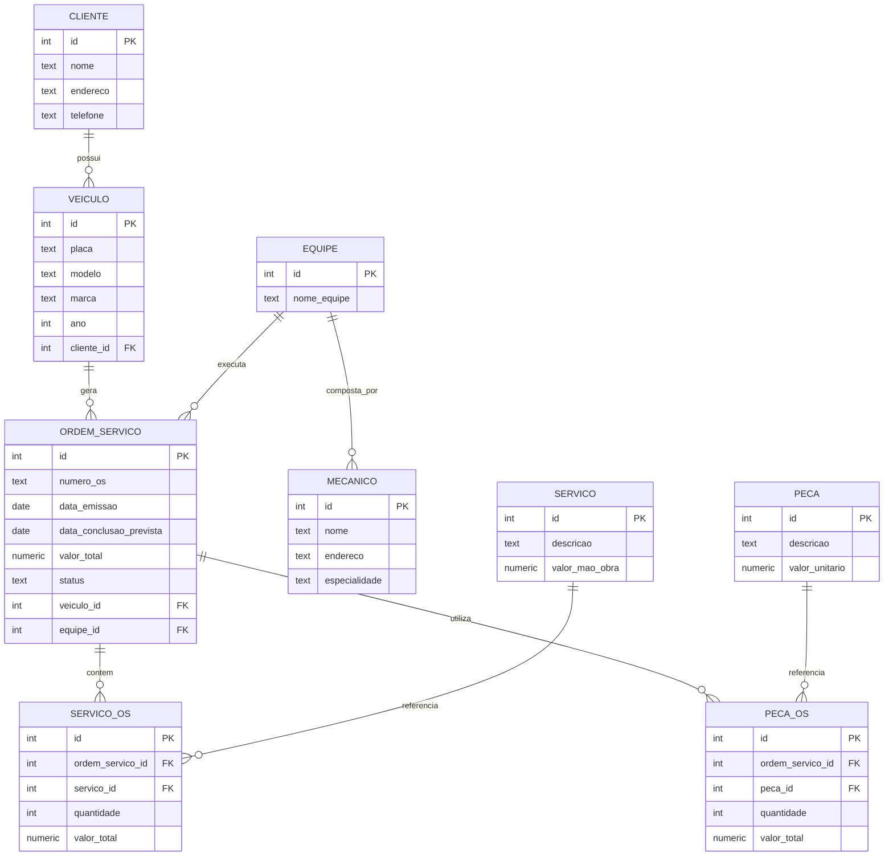

# Projeto Lógico – Banco de Dados de Oficina Mecânica

## 1. Contexto e Objetivo

Este projeto implementa o **modelo lógico e físico** de um sistema de **oficina mecânica**, com base no modelo conceitual elaborado anteriormente.  
O banco de dados foi desenvolvido para o **PostgreSQL**, no banco denominado **`db_oficina`**, e tem como finalidade controlar clientes, veículos, ordens de serviço, equipes de mecânicos, peças e serviços.

O projeto contempla:
- Criação do esquema lógico relacional completo (DDL);
- Inserção de dados para testes (DML);
- Consultas SQL complexas envolvendo `SELECT`, `WHERE`, `ORDER BY`, `HAVING` e `JOIN`;
- Diagrama conceitual em formato Mermaid.

---

## 2. Estrutura de Diretórios

├─ README.md → documentação completa do projeto

├─ schema/
- db_oficina.sql → criação do banco e tabelas (DDL)
- seed_dados.sql → inserções e consultas de teste (DML e SELECTs)

└─ docs/
-  modelo_conceitual.mmd → diagrama ER em formato Mermaid
-  modelo_logico.png # diagrama lógico exportado do pgAdmin (ERD)

---

## 3. Modelo Conceitual (Mermaid)

## 4. Criação do Banco de Dados
``CREATE DATABASE db_oficina TEMPLATE template0;
\c db_oficina;``

## 5. Execução do Projeto
Passo 1 — Criar o banco
``CREATE DATABASE db_oficina TEMPLATE template0;``
Passo 2 — Executar o script DDL

Arquivo: ``schema/db_oficina.sql``

Passo 3 — Inserir dados de teste

Arquivo: ``schema/seed_dados.sql``

Passo 4 — Executar consultas SQL

Os exemplos de queries estão no final do arquivo ``seed_dados.sql``, cobrindo:

``SELECT`` simples;

``WHERE`` com filtros;

Expressões derivadas (subtotais e totais);

``ORDER BY`` com ordenações múltiplas;

``HAVING`` para grupos filtrados;

``JOINs`` entre várias tabelas.

## 6. Principais Consultas Demonstradas
| Tipo               | Exemplo de Query                          |
| ------------------ | ----------------------------------------- |
| **SELECT + WHERE** | Clientes e veículos filtrados por nome    |
| **DERIVADOS**      | Valor total de cada OS (serviços + peças) |
| **ORDER BY**       | OS ordenadas por valor e data             |
| **HAVING**         | Clientes com faturamento acima de R$ 500  |
| **JOIN**           | Relatórios de equipes, peças e serviços   |
